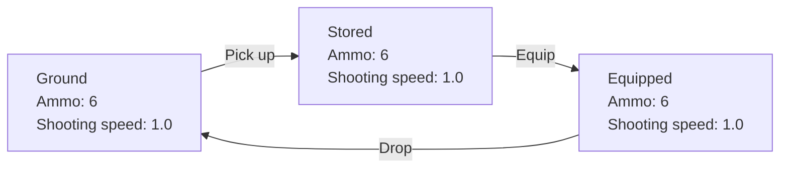
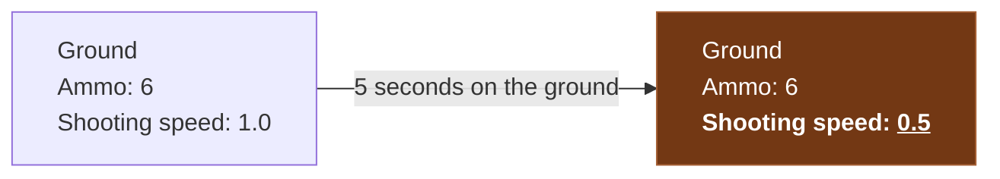

# Rusty Items

First thing first. Let's discuss in detail the mechanics we're going to build.

## Three states of an item

An item should occupy one of three mutually exclusive states:

- **Ground:** present in the world and can be picked up by the player.
- **Stored:** held in an inventory and represented by an inventory slot.
- **Equipped:** actively held and used by the player.

*One item, three representations. Ammunition and condition stay with the item.*

We want to allow the same item to move between these three states any number of times. The amount of remaining ammo, the condition of the item and any other properties accumulated during gameplay should be preserved between these states.

A character that spends half of the bullets of a gun should be able to drop it on the ground and pick it back up again with the exact same ammo count. Sounds simple enough!

## Rusty and grounded seconds

An item becomes **Rusty** after spending five seconds on the ground. Each item has to know that it lies on the ground. It should also count how many seconds have passed! After a total of five seconds on the ground, an item should become rusty. Which will be accompanied by the item turning brown and shooting slower when equipped.

Storing or equipping an item pauses the counter.

Rusty doubles an item's cooldown and gives its ground mesh, equipped mesh, and inventory background a brown appearance.

The following pages cover [Lyra's item system](lyra-item-system.md) and
[implementing Rusty in Lyra](rusty-in-lyra.md).
